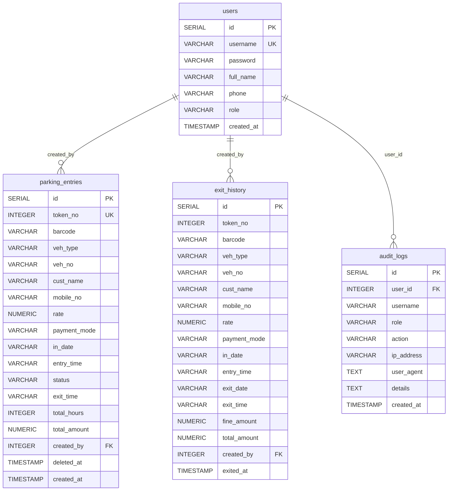

# SSA Two-Wheeler Parking — Database ER Diagram

## Table Descriptions

| Table | Purpose |
|-------|---------|
| `users` | System users with roles (owner, manager, cashier, security) |
| `parking_entries` | Active and soft-deleted vehicle parking records |
| `exit_history` | Archived records of vehicles that have exited |
| `audit_logs` | Security and operational audit trail |

## Sequence
| Sequence | Start | Purpose |
|----------|-------|---------|
| `parking_token_seq` | 500 | Race-condition safe token number generation |

## Views
| View | Description |
|------|-------------|
| `vw_dashboard` | Today's active vehicles and revenue |
| `vw_daily_collection` | Daily revenue grouped by exit_date |
| `vw_monthly_collection` | Monthly revenue aggregated by exited_at |
| `vw_vehicle_summary` | Vehicle type distribution and revenue |

## PL/pgSQL Functions
| Function | Returns | Description |
|----------|---------|-------------|
| `fn_get_daily_summary(p_date)` | TABLE | Today's vehicle count, revenue, cash, GPAY, fine totals |
